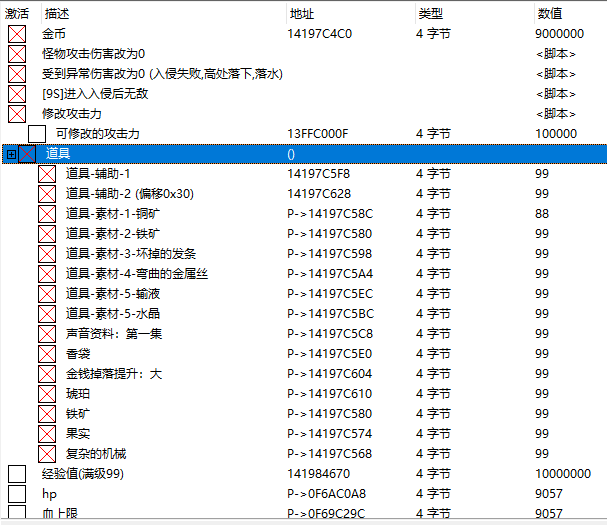
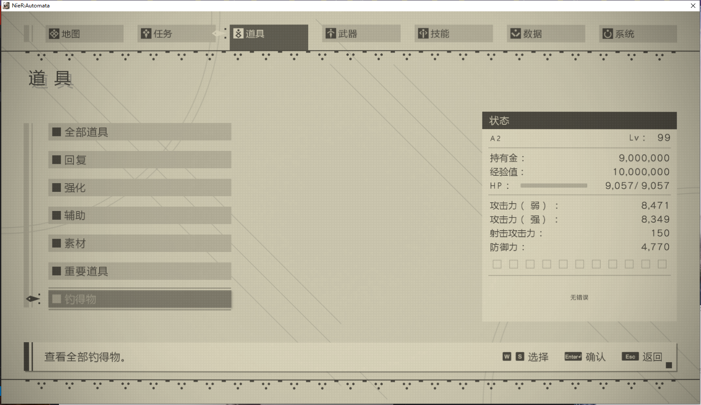

## 尼尔：机械纪元

[下载游戏](https://www.3dmgame.com/games/nierautomata/)

注：
- 找攻击力内存地址: 先将等级重置为1，未知的初始值，4字节, 然后切换攻击力，使用排除法，基本就能找到
- 道具内存地址不是固定的，找到后最好直接锁住，找到一个背包地址后，向左或者向右偏移地址，就能找到其他的背包
- 数据基本是4字节类型
- 射击攻击力 未找到
- 防御力 未找到
- [9S角色]入侵后倒计时 未找到
- 攻击力是注入的脚本，修改后，在游戏中的攻击力显示是不会变化的